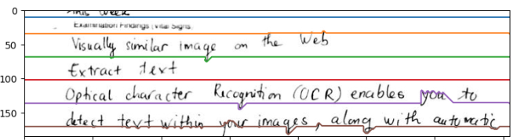

# Line_Segmentation

- [x] Line Segmentation Based on Bi-variate Gauss Statistic and Distance Metric
- [x] Line Segmentation Based on A* algorithm
- [ ] Handwritten Recognition [developing](https://github.com/ai-forever/StackMix-OCR)
- [ ] Demo (now you can run my python program to test your image)
- Test Image

- After segmenting:

  + Bivariate Gauss:

  + AStar Algorithm:

  
