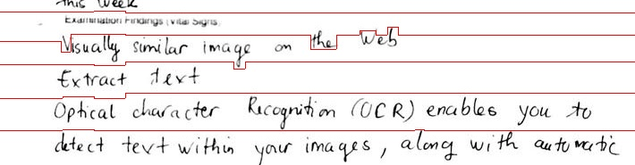

# Repo Description
- [x] Line Segmentation Based on Bi-variate Gauss Statistic and Distance Metric
- [x] Line Segmentation Based on A* algorithm
- [ ] Handwritten Word Recognition [developing]
- [ ] Handwritten Sentence Recognition [developing](https://github.com/ai-forever/StackMix-OCR)
- [ ] Demo (now you can run my python program to test your image)

# Line_Segmentation 
- Test Image

- After segmenting:

  + Bivariate Gauss:

  + AStar Algorithm:

# Handwritten Word Recognition

# Handwritten Sentence Recognition
  

# Excellent Reference
[trocr-base-handwritten-Microsoft](ohttps://huggingface.co/microsoft/trocr-base-handwritten)